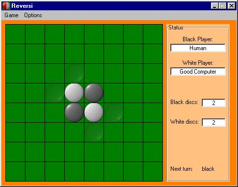



## A reversi \(othello\) game with AI

### Description

This is a program that uses alpha beta search to play reversi, at its highest level it searches 6 moves during the game plus playing the last 12 moves perfectly, so it plays at a really good level and it is hard to beat for most people, the game also includes a setup mode that lets you setup any position to play, and you can ask the computer to make a move suggstion for you, the code is well commented, so please vote or comment if you liked the code.
 
### More Info
 

             |
---                |---
**Submitted On**   |2003-08-22 08:35:08
**By**             |[sohaib farsakh](https://github.com/Planet-Source-Code/PSCIndex/blob/master/ByAuthor/sohaib-farsakh.md)
**Level**          |Intermediate
**User Rating**    |4.4 (22 globes from 5 users)
**Compatibility**  |VB 6\.0
**Category**       |[Games](https://github.com/Planet-Source-Code/PSCIndex/blob/master/ByCategory/games__1-38.md)
**World**          |[Visual Basic](https://github.com/Planet-Source-Code/PSCIndex/blob/master/ByWorld/visual-basic.md)
**Archive File**   |[A\_reversi\_1781728142004\.zip](https://github.com/Planet-Source-Code/sohaib-farsakh-a-reversi-othello-game-with-ai__1-55558/archive/master.zip)

